## Tổng quan Dự án

Dựa trên thông tin bạn cung cấp, tôi sẽ xây dựng quy trình phát triển phần mềm tinh gọn cho:

- **Loại phần mềm**: Ứng dụng web/mobile app
- **Thời gian dự kiến**: 2-3 tuần
- **Mục tiêu chính**: Tốc độ phát triển, chất lượng và tính linh hoạt
- **Đối tượng**: Người chưa từng làm việc với AI agents

Do thời gian rất ngắn (2-3 tuần), quy trình sau đây đã được tối ưu để phù hợp với các dự án phát triển nhanh, đồng thời vẫn đảm bảo chất lượng.

```mermaid
flowchart TD
    %% GIAI ĐOẠN 1: KHỞI TẠO DỰ ÁN & XÁC ĐỊNH YÊU CẦU (2-3 ngày)
    A1[Owner: Hoàn thành Template Tầm nhìn Dự án] --> A2[PM Agent: Phân tích & Tạo PRD]
    A2 --> A3[Owner: Review & Phê duyệt PRD]
    A3 --> B1
    
    %% GIAI ĐOẠN 2: THIẾT KẾ & LẬP KẾ HOẠCH (3-4 ngày)
    B1[UI/UX Agent: Tạo Wireframes nhanh] --> B2[Owner: Review & Phê duyệt Wireframes]
    B2 --> B3[UI/UX Agent: Tạo Mockups & Tài liệu Thiết kế]
    B3 --> B4[Developer Agent: Phân tích kỹ thuật & Tạo Kế hoạch Sprint]
    B4 --> B5[Owner & PM: Review & Phê duyệt Kế hoạch]
    B5 --> C1
    
    %% GIAI ĐOẠN 3: PHÁT TRIỂN & KIỂM THỬ (7-9 ngày)
    C1[Developer Agent: Phát triển Sprint duy nhất] --> C2[PM Agent: Kiểm tra tiến độ hàng ngày]
    C2 --> C3[Owner: Review tiến độ mỗi 2 ngày]
    C3 --> C4[Developer Agent: Tạo phiên bản MVP]
    C4 --> C5[PM & Owner: Kiểm thử MVP]
    C5 --> C6[Developer Agent: Sửa lỗi & Hoàn thiện]
    C6 --> D1
    
    %% GIAI ĐOẠN 4: HOÀN THIỆN & TRIỂN KHAI (2-3 ngày)
    D1[Developer Agent: Tạo Hướng dẫn Triển khai] --> D2[Owner: Kiểm thử cuối cùng]
    D2 --> D3[Developer Agent: Triển khai sản phẩm]
    D3 --> D4[PM Agent: Tạo Báo cáo Kết thúc Dự án]
    D4 --> D5[Team: Họp Retrospective]
    
    %% Định dạng các giai đoạn
    subgraph "Giai đoạn 1: Khởi tạo Dự án & Xác định Yêu cầu (2-3 ngày)"
    A1
    A2
    A3
    end
    
    subgraph "Giai đoạn 2: Thiết kế & Lập Kế hoạch (3-4 ngày)"
    B1
    B2
    B3
    B4
    B5
    end
    
    subgraph "Giai đoạn 3: Phát triển & Kiểm thử (7-9 ngày)"
    C1
    C2
    C3
    C4
    C5
    C6
    end
    
    subgraph "Giai đoạn 4: Hoàn thiện & Triển khai (2-3 ngày)"
    D1
    D2
    D3
    D4
    D5
    end
    
    %% Màu sắc cho các vai trò
    classDef owner fill:#d4f1f9,stroke:#05728f,color:black
    classDef pm fill:#ffe6cc,stroke:#d79b00,color:black
    classDef uiux fill:#d5e8d4,stroke:#82b366,color:black
    classDef dev fill:#e1d5e7,stroke:#9673a6,color:black
    classDef decision fill:#f8cecc,stroke:#b85450,color:black
    
    %% Áp dụng màu sắc
    class A1,A3,B2,B5,C3,C5,D2 owner
    class A2,B5,C2,D4 pm
    class B1,B3 uiux
    class B4,C1,C4,C6,D1,D3 dev
```



## Mô tả Chi tiết Từng Giai đoạn

### GIAI ĐOẠN 1: KHỞI TẠO DỰ ÁN & XÁC ĐỊNH YÊU CẦU (2-3 ngày)

### 1.1. Owner: Hoàn thành Template Tầm nhìn Dự án

**Mô tả công việc:**

- Hoàn thành Template Tầm nhìn Dự án với thông tin cốt lõi về dự án
- Định nghĩa mục tiêu, phạm vi và đối tượng người dùng

**Đầu vào:**

- Template Tầm nhìn Dự án

**Đầu ra:**

- Tài liệu Tầm nhìn Dự án đã hoàn thành

**Chuyển cho:** PM Agent

**Thời gian hoàn thành:** 1 ngày

```mermaid
# TEMPLATE TẦM NHÌN DỰ ÁN

## THÔNG TIN CƠ BẢN
- **Tên dự án:** [Điền tên dự án]
- **Người sở hữu:** [Tên Owner]
- **Ngày tạo:** [DD/MM/YYYY]

## 1. TẦM NHÌN VÀ MỤC TIÊU
### 1.1. Tầm nhìn tổng thể
> *Mô tả ngắn gọn (2-3 câu) về tầm nhìn tổng thể của sản phẩm*
...

### 1.2. Mục tiêu cụ thể
> *Liệt kê 3-5 mục tiêu SMART (Specific, Measurable, Achievable, Relevant, Time-bound)*
1. ...
2. ...
3. ...

### 1.3. Vấn đề cần giải quyết
> *Mô tả vấn đề mà sản phẩm sẽ giải quyết*
...

## 2. THÔNG TIN SẢN PHẨM
### 2.1. Loại sản phẩm
- [ ] Ứng dụng web
- [ ] Ứng dụng mobile (iOS)
- [ ] Ứng dụng mobile (Android)
- [ ] Ứng dụng cross-platform
- [ ] Khác: [Ghi rõ]

### 2.2. Phạm vi dự án
**Trong phạm vi:**
- ...
- ...

**Ngoài phạm vi:**
- ...
- ...

### 2.3. Đối tượng người dùng
> *Mô tả đối tượng người dùng chính (persona)*
- **Người dùng 1:**
  - Đặc điểm nhân khẩu học: ...
  - Nhu cầu/vấn đề: ...
  - Kỳ vọng: ...

- **Người dùng 2 (nếu có):**
  - Đặc điểm nhân khẩu học: ...
  - Nhu cầu/vấn đề: ...
  - Kỳ vọng: ...

## 3. YÊU CẦU BAN ĐẦU
### 3.1. Tính năng chính
> *Liệt kê 5-10 tính năng chính của sản phẩm*
1. ...
2. ...
3. ...

### 3.2. Yêu cầu phi chức năng
> *Liệt kê các yêu cầu về hiệu suất, bảo mật, trải nghiệm người dùng, v.v.*
- **Hiệu suất:** ...
- **Bảo mật:** ...
- **Trải nghiệm người dùng:** ...
- **Khả năng mở rộng:** ...

### 3.3. Ràng buộc
> *Liệt kê các ràng buộc về thời gian, ngân sách, công nghệ, v.v.*
- **Thời gian:** ...
- **Công nghệ:** ...
- **Khác:** ...

## 4. THÔNG TIN TRIỂN KHAI
### 4.1. Thời gian dự kiến
- **Ngày bắt đầu:** [DD/MM/YYYY]
- **Ngày kết thúc:** [DD/MM/YYYY]
- **Tổng thời gian:** [X] tuần

### 4.2. Các cột mốc chính
> *Liệt kê 3-5 cột mốc chính của dự án*
1. **[Tên cột mốc 1]:** [DD/MM/YYYY] - [Mô tả ngắn]
2. **[Tên cột mốc 2]:** [DD/MM/YYYY] - [Mô tả ngắn]
3. **[Tên cột mốc 3]:** [DD/MM/YYYY] - [Mô tả ngắn]

### 4.3. Tiêu chí thành công
> *Làm thế nào để biết dự án thành công? Liệt kê 3-5 tiêu chí*
1. ...
2. ...
3. ...

## 5. THÔNG TIN BỔ SUNG
### 5.1. Tài nguyên hiện có
> *Liệt kê tài nguyên hiện có thể tận dụng (design, content, API, v.v.)*
- ...
- ...

### 5.2. Đối thủ cạnh tranh
> *Liệt kê các sản phẩm tương tự và điểm khác biệt*
- **[Tên đối thủ 1]:** [Điểm khác biệt]
- **[Tên đối thủ 2]:** [Điểm khác biệt]

### 5.3. Ghi chú bổ sung
> *Thông tin bổ sung khác*
...

---

## PHẦN DÀNH CHO PM AGENT
> *Phần này sẽ được PM Agent điền sau khi nhận được tài liệu*

### Câu hỏi làm rõ:
1. ...
2. ...

### Các rủi ro tiềm ẩn:
1. ...
2. ...

### Đề xuất:
...
```

### 1.2. PM Agent: Phân tích & Tạo PRD

**Mô tả công việc:**

- Phân tích Tài liệu Tầm nhìn Dự án
- Làm rõ các yêu cầu nếu cần
- Tạo PRD chi tiết với user stories, tiêu chí chấp nhận

**Đầu vào:**

- Tài liệu Tầm nhìn Dự án

**Đầu ra:**

- Tài liệu PRD (Product Requirements Document)

**Chuyển cho:** Owner

**Thời gian hoàn thành:** 1 ngày

```mermaid
# TÀI LIỆU YÊU CẦU SẢN PHẨM (PRD)

## THÔNG TIN CHUNG
- **Tên dự án:** [Tên dự án]
- **Phiên bản:** 1.0
- **Ngày tạo:** [DD/MM/YYYY]
- **Người phê duyệt:** [Tên Owner]
- **Người chuẩn bị:** Product Manager Agent

## 1. TỔNG QUAN SẢN PHẨM
### 1.1 Mô tả sản phẩm
> *Mô tả ngắn gọn về sản phẩm và mục đích của nó*
...

### 1.2 Mục tiêu chính
> *Liệt kê 3-5 mục tiêu chính của sản phẩm*
1. ...
2. ...
3. ...

### 1.3 Đối tượng người dùng
> *Mô tả đối tượng người dùng chính*
...

## 2. USER STORIES & YÊU CẦU CHỨC NĂNG

### 2.1 Epics & User Stories

#### Epic 1: [Tên Epic]
| ID | Với tư cách là | Tôi muốn | Để | Độ ưu tiên | Ghi chú |
|----|---------------|---------|-----|-----------|---------|
| US-001 | [Loại người dùng] | [Hành động] | [Lợi ích] | [Cao/Trung bình/Thấp] | [Ghi chú] |
| US-002 | [Loại người dùng] | [Hành động] | [Lợi ích] | [Cao/Trung bình/Thấp] | [Ghi chú] |

#### Epic 2: [Tên Epic]
| ID | Với tư cách là | Tôi muốn | Để | Độ ưu tiên | Ghi chú |
|----|---------------|---------|-----|-----------|---------|
| US-003 | [Loại người dùng] | [Hành động] | [Lợi ích] | [Cao/Trung bình/Thấp] | [Ghi chú] |
| US-004 | [Loại người dùng] | [Hành động] | [Lợi ích] | [Cao/Trung bình/Thấp] | [Ghi chú] |

### 2.2 Chi tiết User Story

#### US-001: [Tiêu đề ngắn gọn]
**Mô tả:** [Mô tả chi tiết hơn nếu cần]

**Tiêu chí chấp nhận:**
- [ ] [Tiêu chí 1]
- [ ] [Tiêu chí 2]
- [ ] [Tiêu chí 3]

**Mockup/Wireframe:** [Link hoặc mô tả ngắn gọn]

#### US-002: [Tiêu đề ngắn gọn]
**Mô tả:** [Mô tả chi tiết hơn nếu cần]

**Tiêu chí chấp nhận:**
- [ ] [Tiêu chí 1]
- [ ] [Tiêu chí 2]
- [ ] [Tiêu chí 3]

**Mockup/Wireframe:** [Link hoặc mô tả ngắn gọn]

## 3. YÊU CẦU GIAO DIỆN NGƯỜI DÙNG

### 3.1 Danh sách màn hình
> *Liệt kê tất cả các màn hình/trang cần thiết kế*
1. **[Tên màn hình 1]:** [Mô tả ngắn]
2. **[Tên màn hình 2]:** [Mô tả ngắn]
3. **[Tên màn hình 3]:** [Mô tả ngắn]

### 3.2 Luồng người dùng
> *Mô tả các luồng người dùng chính*
1. **Luồng 1:** [Mô tả step-by-step]
2. **Luồng 2:** [Mô tả step-by-step]

### 3.3 Yêu cầu trải nghiệm người dùng
> *Liệt kê các yêu cầu về UX*
- ...
- ...

## 4. YÊU CẦU KỸ THUẬT

### 4.1 Yêu cầu phi chức năng
| Loại | Mô tả | Độ ưu tiên |
|------|-------|-----------|
| Hiệu năng | [Yêu cầu về hiệu năng] | [Cao/Trung bình/Thấp] |
| Bảo mật | [Yêu cầu về bảo mật] | [Cao/Trung bình/Thấp] |
| Khả năng mở rộng | [Yêu cầu về khả năng mở rộng] | [Cao/Trung bình/Thấp] |
| Khả năng truy cập | [Yêu cầu về accessibility] | [Cao/Trung bình/Thấp] |

### 4.2 Công nghệ đề xuất
> *Đề xuất stack công nghệ*
- **Frontend:** [Công nghệ]
- **Backend:** [Công nghệ]
- **Database:** [Công nghệ]
- **Khác:** [Công nghệ]

## 5. ROADMAP & TIMELINE

### 5.1 Phân chia giai đoạn
> *Phân chia dự án thành các giai đoạn nhỏ*

#### Giai đoạn 1: MVP (Minimum Viable Product)
- **Thời gian:** [X] ngày
- **Mục tiêu:** [Mô tả]
- **User Stories:** US-001, US-002, ...
- **Đầu ra:** [Mô tả]

#### Giai đoạn 2: Hoàn thiện
- **Thời gian:** [X] ngày
- **Mục tiêu:** [Mô tả]
- **User Stories:** US-003, US-004, ...
- **Đầu ra:** [Mô tả]

### 5.2 Timeline
| Ngày | Cột mốc | Mô tả |
|------|---------|-------|
| [DD/MM] | [Tên cột mốc] | [Mô tả] |
| [DD/MM] | [Tên cột mốc] | [Mô tả] |

## 6. RỦI RO & GIẢM THIỂU

| Rủi ro | Mức độ ảnh hưởng | Khả năng xảy ra | Biện pháp giảm thiểu |
|-------|-----------------|----------------|---------------------|
| [Mô tả rủi ro] | [Cao/Trung bình/Thấp] | [Cao/Trung bình/Thấp] | [Biện pháp] |
| [Mô tả rủi ro] | [Cao/Trung bình/Thấp] | [Cao/Trung bình/Thấp] | [Biện pháp] |

## 7. METRICS & ĐÁNH GIÁ THÀNH CÔNG

| Metric | Mục tiêu | Cách đo lường |
|--------|---------|--------------|
| [Tên metric] | [Mục tiêu] | [Cách đo lường] |
| [Tên metric] | [Mục tiêu] | [Cách đo lường] |

## 8. PHỤ LỤC

### 8.1 Thuật ngữ
| Thuật ngữ | Giải thích |
|-----------|-----------|
| [Thuật ngữ] | [Giải thích] |
| [Thuật ngữ] | [Giải thích] |

### 8.2 Tài liệu tham khảo
- [Tên tài liệu 1]
- [Tên tài liệu 2]

---

## PHẦN PHÊ DUYỆT
- [ ] PRD đã được phê duyệt bởi Owner
- [ ] PRD đã được chia sẻ với UI/UX Agent và Developer Agent

**Ngày phê duyệt:** [DD/MM/YYYY]
**Chữ ký Owner:** ____________________
```

### 1.3. Owner: Review & Phê duyệt PRD

**Mô tả công việc:**

- Review PRD
- Cung cấp phản hồi và yêu cầu chỉnh sửa nếu cần
- Phê duyệt PRD

**Đầu vào:**

- Tài liệu PRD từ PM Agent

**Đầu ra:**

- PRD đã được phê duyệt

**Chuyển cho:** UI/UX Agent và Developer Agent

**Thời gian hoàn thành:** 0.5-1 ngày

### GIAI ĐOẠN 2: THIẾT KẾ & LẬP KẾ HOẠCH (3-4 ngày)

### 2.1. UI/UX Agent: Tạo Wireframes nhanh

**Mô tả công việc:**

- Phân tích PRD
- Tạo wireframes cho các màn hình chính
- Xác định luồng người dùng cơ bản

**Đầu vào:**

- PRD đã được phê duyệt

**Đầu ra:**

- Wireframes cho các màn hình chính
- Tài liệu mô tả luồng người dùng

**Chuyển cho:** Owner

**Thời gian hoàn thành:** 1-2 ngày

```mermaid
# WIREFRAMES & LUỒNG NGƯỜI DÙNG

## THÔNG TIN CHUNG
- **Tên dự án:** [Tên dự án]
- **Phiên bản:** 1.0
- **Ngày tạo:** [DD/MM/YYYY]
- **Người phê duyệt:** [Tên Owner]
- **Người chuẩn bị:** UI/UX Designer Agent

## 1. TỔNG QUAN
### 1.1 Mục đích tài liệu
> *Mô tả mục đích của tài liệu Wireframes và Luồng người dùng*
...

### 1.2 Danh sách màn hình
> *Liệt kê tất cả các màn hình được wireframe*
1. [Tên màn hình 1]
2. [Tên màn hình 2]
3. [Tên màn hình 3]
...

## 2. WIREFRAMES

### 2.1 [Tên màn hình 1]
#### Mô tả:
> *Mô tả ngắn gọn về màn hình và mục đích của nó*
...

#### Wireframe:
> *Chèn hình ảnh wireframe hoặc link đến file thiết kế*
[Chèn hình ảnh hoặc link]

#### Các thành phần chính:
1. **[Tên thành phần]:**
   - Mục đích: [Mô tả]
   - Hành vi: [Mô tả]
   - User stories liên quan: [US-XXX]

2. **[Tên thành phần]:**
   - Mục đích: [Mô tả]
   - Hành vi: [Mô tả]
   - User stories liên quan: [US-XXX]

### 2.2 [Tên màn hình 2]
#### Mô tả:
> *Mô tả ngắn gọn về màn hình và mục đích của nó*
...

#### Wireframe:
> *Chèn hình ảnh wireframe hoặc link đến file thiết kế*
[Chèn hình ảnh hoặc link]

#### Các thành phần chính:
1. **[Tên thành phần]:**
   - Mục đích: [Mô tả]
   - Hành vi: [Mô tả]
   - User stories liên quan: [US-XXX]

2. **[Tên thành phần]:**
   - Mục đích: [Mô tả]
   - Hành vi: [Mô tả]
   - User stories liên quan: [US-XXX]

## 3. LUỒNG NGƯỜI DÙNG
### 3.1 [Tên luồng 1]
#### Mô tả:
> *Mô tả ngắn gọn về luồng người dùng*
...

#### Sơ đồ luồng:
> *Chèn hình ảnh hoặc mô tả bằng văn bản*
1. Bắt đầu từ [Màn hình X]
2. Người dùng [hành động]
3. Hệ thống [phản hồi]
4. Chuyển đến [Màn hình Y]
...

#### User Stories liên quan:
- US-001
- US-002
...

### 3.2 [Tên luồng 2]
#### Mô tả:
> *Mô tả ngắn gọn về luồng người dùng*
...

#### Sơ đồ luồng:
> *Chèn hình ảnh hoặc mô tả bằng văn bản*
1. Bắt đầu từ [Màn hình X]
2. Người dùng [hành động]
3. Hệ thống [phản hồi]
4. Chuyển đến [Màn hình Y]
...

#### User Stories liên quan:
- US-003
- US-004
...

## 4. RESPONSIVE DESIGN
### 4.1 Nguyên tắc chung
> *Mô tả nguyên tắc chung về responsive design*
...

### 4.2 Breakpoints
| Thiết bị | Kích thước | Lưu ý |
|---------|------------|-------|
| Mobile | < 768px | [Lưu ý] |
| Tablet | 768px - 1024px | [Lưu ý] |
| Desktop | > 1024px | [Lưu ý] |

### 4.3 Điều chỉnh theo thiết bị
| Màn hình | Mobile | Tablet | Desktop |
|----------|--------|--------|---------|
| [Màn hình 1] | [Điều chỉnh] | [Điều chỉnh] | [Điều chỉnh] |
| [Màn hình 2] | [Điều chỉnh] | [Điều chỉnh] | [Điều chỉnh] |

## 5. PHẢN HỒI & CẢI TIẾN
### 5.1 Câu hỏi cho Owner
> *Danh sách câu hỏi cần làm rõ*
1. [Câu hỏi 1]
2. [Câu hỏi 2]
...

### 5.2 Các phương án thay thế
> *Nếu có các phương án thiết kế thay thế, liệt kê ở đây*
- **Phương án A:** [Mô tả]
- **Phương án B:** [Mô tả]
...

---

## PHẦN PHÊ DUYỆT
- [ ] Wireframes đã được phê duyệt bởi Owner
- [ ] Luồng người dùng đã được phê duyệt bởi Owner

**Ngày phê duyệt:** [DD/MM/YYYY]
**Chữ ký Owner:** ____________________

**Phản hồi của Owner:**
> *Phần này dành cho Owner ghi phản hồi*
...
```

### 2.2. Owner: Review & Phê duyệt Wireframes

**Mô tả công việc:**

- Review wireframes và luồng người dùng
- Cung cấp phản hồi
- Phê duyệt wireframes

**Đầu vào:**

- Wireframes và tài liệu luồng người dùng

**Đầu ra:**

- Wireframes đã được phê duyệt
- Phản hồi về luồng người dùng

**Chuyển cho:** UI/UX Agent

**Thời gian hoàn thành:** 0.5 ngày

### 2.3. UI/UX Agent: Tạo Mockups & Tài liệu Thiết kế

**Mô tả công việc:**

- Phát triển wireframes thành mockups đầy đủ
- Xác định hệ thống màu sắc, typography, và components
- Tạo tài liệu bàn giao thiết kế

**Đầu vào:**

- Wireframes đã được phê duyệt
- Phản hồi của Owner

**Đầu ra:**

- Mockups chi tiết
- Tài liệu Bàn giao Thiết kế

**Chuyển cho:** Developer Agent

**Thời gian hoàn thành:** 1-2 ngày

```mermaid
# TÀI LIỆU BÀN GIAO THIẾT KẾ

## THÔNG TIN CHUNG
- **Tên dự án:** [Tên dự án]
- **Phiên bản thiết kế:** 1.0
- **Ngày bàn giao:** [DD/MM/YYYY]
- **Designer:** UI/UX Designer Agent
- **Người nhận:** Developer Agent
- **Link thiết kế:** [URL đến Figma/Sketch file nếu có]

## 1. TỔNG QUAN THIẾT KẾ
### 1.1 Danh sách màn hình
> *Liệt kê tất cả các màn hình/trang đã thiết kế*
1. [Tên màn hình 1]
2. [Tên màn hình 2]
3. [Tên màn hình 3]
...

### 1.2 User Stories đã thiết kế
> *Liệt kê các User Stories được thiết kế trong bản này*
- US-001: [Tên User Story]
- US-002: [Tên User Story]
...

## 2. HỆ THỐNG THIẾT KẾ

### 2.1 Bảng màu
| Tên màu | Mã màu (HEX) | Mã màu (RGB) | Mục đích sử dụng |
|---------|-------------|-------------|-----------------|
| Primary | #XXXXXX | rgb(x,x,x) | [Mục đích sử dụng] |
| Secondary | #XXXXXX | rgb(x,x,x) | [Mục đích sử dụng] |
| Background | #XXXXXX | rgb(x,x,x) | [Mục đích sử dụng] |
| Text Primary | #XXXXXX | rgb(x,x,x) | [Mục đích sử dụng] |
| Text Secondary | #XXXXXX | rgb(x,x,x) | [Mục đích sử dụng] |
| Error | #XXXXXX | rgb(x,x,x) | [Mục đích sử dụng] |
| Success | #XXXXXX | rgb(x,x,x) | [Mục đích sử dụng] |

### 2.2 Typography
| Element | Font Family | Weight | Size | Line Height | Mục đích sử dụng |
|---------|------------|--------|------|-------------|-----------------|
| H1 | [Font] | [Weight] | [Size]px | [Line Height] | [Mục đích sử dụng] |
| H2 | [Font] | [Weight] | [Size]px | [Line Height] | [Mục đích sử dụng] |
| Body | [Font] | [Weight] | [Size]px | [Line Height] | [Mục đích sử dụng] |
| Button | [Font] | [Weight] | [Size]px | [Line Height] | [Mục đích sử dụng] |

### 2.3 Components
| Component | Biến thể | State | Mô tả & Hướng dẫn sử dụng |
|-----------|---------|-------|---------------------------|
| Button | Primary | Default, Hover, Active, Disabled | [Mô tả & hướng dẫn] |
| Button | Secondary | Default, Hover, Active, Disabled | [Mô tả & hướng dẫn] |
| Input | Text | Default, Focus, Error, Disabled | [Mô tả & hướng dẫn] |
| Card | Basic | Default | [Mô tả & hướng dẫn] |
| [Component khác] | [Biến thể] | [State] | [Mô tả & hướng dẫn] |

### 2.4 Spacing & Grid
- **Baseline grid:** [Mô tả]
- **Column grid:** [Mô tả]
- **Padding standard:** [Giá trị]px
- **Margin standard:** [Giá trị]px

## 3. CHI TIẾT MÀN HÌNH

### 3.1 [Tên màn hình 1]


**Mô tả chung:**
> *Mô tả ngắn gọn về màn hình*
...

**Các thành phần chính:**
1. **[Tên thành phần]:**
   - Components sử dụng: [Components]
   - Hành vi: [Mô tả hành vi]
   - Xử lý điều kiện: [Mô tả nếu có]

2. **[Tên thành phần]:**
   - Components sử dụng: [Components]
   - Hành vi: [Mô tả hành vi]
   - Xử lý điều kiện: [Mô tả nếu có]

**Responsive:**
- **Mobile (< 768px):** [Mô tả điều chỉnh]
- **Tablet (768px - 1024px):** [Mô tả điều chỉnh]
- **Desktop (> 1024px):** [Mô tả điều chỉnh]

**User Stories liên quan:**
- US-001
- US-002

### 3.2 [Tên màn hình 2]


**Mô tả chung:**
> *Mô tả ngắn gọn về màn hình*
...

**Các thành phần chính:**
1. **[Tên thành phần]:**
   - Components sử dụng: [Components]
   - Hành vi: [Mô tả hành vi]
   - Xử lý điều kiện: [Mô tả nếu có]

2. **[Tên thành phần]:**
   - Components sử dụng: [Components]
   - Hành vi: [Mô tả hành vi]
   - Xử lý điều kiện: [Mô tả nếu có]

**Responsive:**
- **Mobile (< 768px):** [Mô tả điều chỉnh]
- **Tablet (768px - 1024px):** [Mô tả điều chỉnh]
- **Desktop (> 1024px):** [Mô tả điều chỉnh]

**User Stories liên quan:**
- US-003
- US-004

## 4. TƯƠNG TÁC & ANIMATION

### 4.1 Chuyển trang
| Từ | Đến | Animation | Thời gian | Mô tả |
|----|-----|-----------|-----------|-------|
| [Màn hình A] | [Màn hình B] | [Loại] | [Thời gian]ms | [Mô tả] |
| [Màn hình B] | [Màn hình C] | [Loại] | [Thời gian]ms | [Mô tả] |

### 4.2 Micro-interactions
| Element | Sự kiện | Kết quả | Mô tả |
|---------|--------|---------|-------|
| [Element] | [Sự kiện] | [Kết quả] | [Mô tả] |
| [Element] | [Sự kiện] | [Kết quả] | [Mô tả] |

## 5. ASSET INVENTORY

### 5.1 Icons
| Tên | Preview | Format | Kích thước | Path |
|-----|---------|--------|-----------|------|
| [Tên icon] | [Preview] | [SVG/PNG] | [Kích thước] | [Path] |
| [Tên icon] | [Preview] | [SVG/PNG] | [Kích thước] | [Path] |

### 5.2 Images
| Tên | Preview | Format | Kích thước | Path |
|-----|---------|--------|-----------|------|
| [Tên image] | [Preview] | [JPG/PNG] | [Kích thước] | [Path] |
| [Tên image] | [Preview] | [JPG/PNG] | [Kích thước] | [Path] |

## 6. LƯU Ý CHO DEVELOPER

### 6.1 Độ ưu tiên phát triển
| Màn hình | Độ ưu tiên | Ghi chú |
|----------|-----------|---------|
| [Màn hình 1] | [Cao/Trung bình/Thấp] | [Ghi chú] |
| [Màn hình 2] | [Cao/Trung bình/Thấp] | [Ghi chú] |

### 6.2 Các vấn đề đã biết
| Vấn đề | Mức độ | Giải pháp tạm thời |
|--------|--------|-------------------|
| [Mô tả vấn đề] | [Cao/Trung bình/Thấp] | [Giải pháp tạm thời] |
| [Mô tả vấn đề] | [Cao/Trung bình/Thấp] | [Giải pháp tạm thời] |

## 7. PHỤ LỤC

### 7.1 Thuật ngữ thiết kế
| Thuật ngữ | Giải thích |
|-----------|-----------|
| [Thuật ngữ] | [Giải thích] |
| [Thuật ngữ] | [Giải thích] |

### 7.2 Lịch sử thay đổi
| Phiên bản | Ngày | Mô tả thay đổi |
|-----------|------|---------------|
| 1.0 | [DD/MM/YYYY] | Phiên bản đầu tiên |

---

## XÁC NHẬN BÀN GIAO
- [ ] Tài liệu thiết kế đã được bàn giao cho Developer Agent
- [ ] Developer Agent đã xác nhận đã nhận và hiểu tài liệu
- [ ] Mọi câu hỏi về thiết kế đã được trả lời

**Ngày bàn giao:** [DD/MM/YYYY]
**Người bàn giao:** UI/UX Designer Agent
**Người nhận bàn giao:** Developer Agent
```

### 2.4. Developer Agent: Phân tích kỹ thuật & Tạo Kế hoạch Sprint

**Mô tả công việc:**

- Phân tích kỹ thuật dựa trên PRD và tài liệu thiết kế
- Xác định các thành phần kỹ thuật cần thiết
- Lập kế hoạch phát triển với timeline chi tiết

**Đầu vào:**

- PRD đã được phê duyệt
- Mockups và Tài liệu Bàn giao Thiết kế

**Đầu ra:**

- Kế hoạch Sprint
- Kiến trúc kỹ thuật cơ bản

**Chuyển cho:** Owner và PM Agent

**Thời gian hoàn thành:** 0.5-1 ngày

```mermaid
# KẾ HOẠCH SPRINT PHÁT TRIỂN NHANH

## THÔNG TIN CHUNG
- **Tên dự án:** [Tên dự án]
- **Sprint:** Sprint 1 (Duy nhất)
- **Thời gian:** [DD/MM/YYYY] đến [DD/MM/YYYY]
- **Người chuẩn bị:** Developer Agent

## 1. MỤC TIÊU SPRINT
> *Mô tả ngắn gọn mục tiêu của sprint này*
...

**Cam kết đầu ra:**
- [Đầu ra 1]
- [Đầu ra 2]
- [Đầu ra 3]

## 2. KIẾN TRÚC KỸ THUẬT

### 2.1 Stack công nghệ
- **Frontend:**
  - Framework: [React/Vue/Angular/...]
  - UI Library: [MUI/Bootstrap/Tailwind/...]
  - State Management: [Redux/Context API/Vuex/...]
  
- **Backend:**
  - Framework: [Express/Django/Laravel/...]
  - Database: [MongoDB/PostgreSQL/MySQL/...]
  - Authentication: [JWT/OAuth/Firebase Auth/...]
  
- **Deployment:**
  - Hosting: [Vercel/Netlify/AWS/...]
  - CI/CD: [GitHub Actions/GitLab CI/...]

### 2.2 Kiến trúc tổng thể
> *Mô tả ngắn gọn về kiến trúc tổng thể của ứng dụng*
...

### 2.3 Các thành phần chính
| Thành phần | Mô tả | Công nghệ |
|-----------|-------|-----------|
| [Tên thành phần] | [Mô tả] | [Công nghệ] |
| [Tên thành phần] | [Mô tả] | [Công nghệ] |
| [Tên thành phần] | [Mô tả] | [Công nghệ] |

## 3. BACKLOG & TASKS

### 3.1 User Stories được triển khai
| ID | User Story | Story Points | Độ ưu tiên |
|----|-----------|--------------|-----------|
| US-001 | [Mô tả] | [Points] | [Cao/Trung bình/Thấp] |
| US-002 | [Mô tả] | [Points] | [Cao/Trung bình/Thấp] |
| US-003 | [Mô tả] | [Points] | [Cao/Trung bình/Thấp] |

### 3.2 Tasks phát triển
| ID | Task | User Story | Thời gian (giờ) | Dependencies | Người thực hiện |
|----|------|-----------|----------------|--------------|-----------------|
| T-001 | [Mô tả] | US-001 | [Thời gian] | N/A | Developer Agent |
| T-002 | [Mô tả] | US-001 | [Thời gian] | T-001 | Developer Agent |
| T-003 | [Mô tả] | US-002 | [Thời gian] | N/A | Developer Agent |
| T-004 | [Mô tả] | US-003 | [Thời gian] | T-003 | Developer Agent |

## 4. LỊCH TRÌNH PHÁT TRIỂN

### 4.1 Timeline chi tiết
| Ngày | Tasks | Mục tiêu |
|------|-------|---------|
| [DD/MM] - Ngày 1 | T-001, T-002 | [Mục tiêu ngày 1] |
| [DD/MM] - Ngày 2 | T-003, T-004 | [Mục tiêu ngày 2] |
| [DD/MM] - Ngày 3 | T-005, T-006 | [Mục tiêu ngày 3] |
| [DD/MM] - Ngày 4 | T-007, T-008 | [Mục tiêu ngày 4] |
| [DD/MM] - Ngày 5 | T-009 | [Mục tiêu ngày 5] |
| [DD/MM] - Ngày 6 | T-010, Bug fixing | [Mục tiêu ngày 6] |
| [DD/MM] - Ngày 7 | Bug fixing, Final testing | [Mục tiêu ngày 7] |

### 4.2 Cột mốc quan trọng
| Cột mốc | Ngày | Mô tả |
|---------|------|-------|
| Setup project | [DD/MM] | Hoàn thành setup project và kiến trúc cơ bản |
| Alpha version | [DD/MM] | Hoàn thành các tính năng cốt lõi |
| Beta version | [DD/MM] | Hoàn thành tất cả tính năng và sẵn sàng kiểm thử |
| Release version | [DD/MM] | Sẵn sàng triển khai |

## 5. CHIẾN LƯỢC KIỂM THỬ

### 5.1 Loại kiểm thử
- [x] Unit Testing
- [x] Integration Testing
- [x] Manual Testing
- [ ] E2E Testing

### 5.2 Test cases
| ID | Loại | Mô tả | Liên quan đến User Story |
|----|------|-------|--------------------------|
| TC-001 | Unit | [Mô tả] | US-001 |
| TC-002 | Integration | [Mô tả] | US-002 |
| TC-003 | Manual | [Mô tả] | US-003 |

## 6. RỦI RO & GIẢI PHÁP

| Rủi ro | Mức độ ảnh hưởng | Xác suất | Chiến lược giảm thiểu |
|-------|-----------------|----------|----------------------|
| [Mô tả rủi ro] | [Cao/Trung bình/Thấp] | [Cao/Trung bình/Thấp] | [Chiến lược] |
| [Mô tả rủi ro] | [Cao/Trung bình/Thấp] | [Cao/Trung bình/Thấp] | [Chiến lược] |

## 7. DEFINITION OF DONE

Một task được coi là hoàn thành khi:
- [ ] Code đã được viết và hoạt động theo yêu cầu
- [ ] Unit tests đã được viết và pass
- [ ] Code đã được review
- [ ] Tất cả các test cases liên quan đều pass
- [ ] Tài liệu API (nếu có) đã được cập nhật
- [ ] UI khớp với thiết kế đã được phê duyệt

Một User Story được coi là hoàn thành khi:
- [ ] Tất cả các tasks liên quan đã hoàn thành
- [ ] Tính năng đáp ứng tất cả các tiêu chí chấp nhận
- [ ] Owner đã review và chấp nhận tính năng

## 8. YÊU CẦU BỔ SUNG

### 8.1 Tài nguyên cần thiết
- [Tài nguyên 1]
- [Tài nguyên 2]

### 8.2 Câu hỏi kỹ thuật
> *Danh sách câu hỏi cần được làm rõ*
1. [Câu hỏi 1]
2. [Câu hỏi 2]

---

## PHÊ DUYỆT KẾ HOẠCH
- [ ] Kế hoạch được phê duyệt bởi Owner
- [ ] Kế hoạch được phê duyệt bởi PM Agent

**Ngày phê duyệt:** [DD/MM/YYYY]
**Người phê duyệt:** ____________________

**Phản hồi:**
> *Phần dành cho Owner và PM Agent đưa phản hồi*
...
```

### 2.5. Owner & PM: Review & Phê duyệt Kế hoạch

**Mô tả công việc:**

- Review kế hoạch sprint và kiến trúc kỹ thuật
- Cung cấp phản hồi và làm rõ các câu hỏi kỹ thuật
- Phê duyệt kế hoạch

**Đầu vào:**

- Kế hoạch Sprint
- Kiến trúc kỹ thuật cơ bản

**Đầu ra:**

- Kế hoạch Sprint đã được phê duyệt
- Phản hồi về các câu hỏi kỹ thuật

**Chuyển cho:** Developer Agent

**Thời gian hoàn thành:** 0.5 ngày

### GIAI ĐOẠN 3: PHÁT TRIỂN & KIỂM THỬ (7-9 ngày)

### 3.1. Developer Agent: Phát triển Sprint duy nhất

**Mô tả công việc:**

- Phát triển các tính năng theo kế hoạch sprint
- Viết mã nguồn và thực hiện unit tests
- Tích hợp với các dịch vụ bên ngoài nếu cần

**Đầu vào:**

- Kế hoạch Sprint đã được phê duyệt
- PRD và Tài liệu Bàn giao Thiết kế

**Đầu ra:**

- Mã nguồn
- Báo cáo tiến độ hàng ngày

**Chuyển cho:** PM Agent

**Thời gian hoàn thành:** 5-7 ngày

```mermaid
# BÁO CÁO TIẾN ĐỘ HÀNG NGÀY

## THÔNG TIN CHUNG
- **Tên dự án:** [Tên dự án]
- **Ngày báo cáo:** [DD/MM/YYYY]
- **Sprint:** Sprint 1
- **Ngày sprint:** Ngày [X]/[Tổng số ngày]
- **Người báo cáo:** Developer Agent

## 1. TÓM TẮT TIẾN ĐỘ
- **Tình trạng chung:** [Đúng tiến độ / Chậm / Sớm hơn kế hoạch]
- **% Hoàn thành sprint:** [X]%
- **Tasks hoàn thành:** [X]/[Tổng số]
- **Story points hoàn thành:** [X]/[Tổng số]

## 2. CÔNG VIỆC ĐÃ HOÀN THÀNH HÔM NAY
| ID | Task | User Story | Thời gian (giờ) | Trạng thái | Ghi chú |
|----|------|-----------|----------------|-----------|---------|
| T-XXX | [Mô tả] | US-XXX | [Thời gian] | Hoàn thành | [Ghi chú] |
| T-XXX | [Mô tả] | US-XXX | [Thời gian] | Hoàn thành | [Ghi chú] |

## 3. CÔNG VIỆC ĐANG THỰC HIỆN
| ID | Task | User Story | Tiến độ | Dự kiến hoàn thành | Ghi chú |
|----|------|-----------|---------|-------------------|---------|
| T-XXX | [Mô tả] | US-XXX | [X]% | [DD/MM/YYYY] | [Ghi chú] |
| T-XXX | [Mô tả] | US-XXX | [X]% | [DD/MM/YYYY] | [Ghi chú] |

## 4. VẤN ĐỀ PHÁT SINH & GIẢI PHÁP
| ID | Vấn đề | Mức độ | Ảnh hưởng | Giải pháp đề xuất | Cần hỗ trợ |
|----|-------|--------|-----------|------------------|-----------|
| I-XXX | [Mô tả] | [Cao/TB/Thấp] | [Ảnh hưởng] | [Giải pháp] | [Có/Không] |
| I-XXX | [Mô tả] | [Cao/TB/Thấp] | [Ảnh hưởng] | [Giải pháp] | [Có/Không] |

## 5. KẾ HOẠCH NGÀY MAI
| ID | Task | User Story | Thời gian dự kiến (giờ) |
|----|------|-----------|------------------------|
| T-XXX | [Mô tả] | US-XXX | [Thời gian] |
| T-XXX | [Mô tả] | US-XXX | [Thời gian] |

## 6. CÂU HỎI & YÊU CẦU LÀM RÕ
> *Liệt kê các câu hỏi hoặc yêu cầu làm rõ (nếu có)*
1. [Câu hỏi 1]
2. [Câu hỏi 2]

## 7. HỌC HỎI & GHI CHÚ
> *Ghi chú về các bài học, phát hiện, hoặc chia sẻ kinh nghiệm*
...
```

### 3.2. PM Agent: Kiểm tra tiến độ hàng ngày

**Mô tả công việc:**

- Theo dõi và cập nhật tiến độ dự án
- Tổng hợp báo cáo tiến độ hàng ngày
- Phát hiện và giải quyết vấn đề sớm

**Đầu vào:**

- Báo cáo tiến độ hàng ngày từ Developer Agent

**Đầu ra:**

- Báo cáo tiến độ tổng hợp
- Danh sách vấn đề cần giải quyết

**Chuyển cho:** Owner (mỗi 2 ngày)

**Thời gian hoàn thành:** Liên tục

```mermaid
# BÁO CÁO TIẾN ĐỘ DỰ ÁN

## THÔNG TIN CHUNG
- **Tên dự án:** [Tên dự án]
- **Thời gian báo cáo:** [DD/MM/YYYY] - [DD/MM/YYYY]
- **Sprint:** Sprint 1
- **Người báo cáo:** Product Manager Agent

## 1. TÓM TẮT TIẾN ĐỘ
- **Tình trạng chung:** [Đúng tiến độ / Chậm / Sớm hơn kế hoạch]
- **% Hoàn thành dự án:** [X]%
- **User Stories hoàn thành:** [X]/[Tổng số]
- **Tasks hoàn thành:** [X]/[Tổng số]

## 2. CẬP NHẬT TIẾN ĐỘ THEO USER STORIES

| ID | User Story | Tiến độ | Trạng thái | Dự kiến hoàn thành | Ghi chú |
|----|-----------|--------|-----------|-------------------|---------|
| US-001 | [Mô tả] | [X]% | [In Progress/Done/Blocked] | [DD/MM/YYYY] | [Ghi chú] |
| US-002 | [Mô tả] | [X]% | [In Progress/Done/Blocked] | [DD/MM/YYYY] | [Ghi chú] |
| US-003 | [Mô tả] | [X]% | [In Progress/Done/Blocked] | [DD/MM/YYYY] | [Ghi chú] |

## 3. THÀNH TỰU CHÍNH

> *Liệt kê các thành tựu chính đã đạt được trong thời gian báo cáo*
1. [Thành tựu 1]
2. [Thành tựu 2]
3. [Thành tựu 3]

## 4. VẤN ĐỀ & RỦI RO

| ID | Vấn đề/Rủi ro | Mức độ | Tác động | Giải pháp | Trạng thái |
|----|--------------|--------|----------|----------|-----------|
| IR-001 | [Mô tả] | [Cao/TB/Thấp] | [Tác động] | [Giải pháp] | [Open/Resolved] |
| IR-002 | [Mô tả] | [Cao/TB/Thấp] | [Tác động] | [Giải pháp] | [Open/Resolved] |

## 5. QUYẾT ĐỊNH CẦN OWNER PHÊ DUYỆT

| ID | Quyết định | Deadline | Tác động nếu trì hoãn | Đề xuất |
|----|-----------|----------|----------------------|---------|
| D-001 | [Mô tả] | [DD/MM/YYYY] | [Tác động] | [Đề xuất] |
| D-002 | [Mô tả] | [DD/MM/YYYY] | [Tác động] | [Đề xuất] |

## 6. KẾ HOẠCH CHO 2 NGÀY TỚI

| Ngày | Mục tiêu | Tasks | 
|------|---------|-------|
| [DD/MM] | [Mục tiêu] | T-XXX, T-XXX, T-XXX |
| [DD/MM] | [Mục tiêu] | T-XXX, T-XXX, T-XXX |

## 7. CẬP NHẬT DỰ BÁO

- **Dự báo hoàn thành Sprint:** [Đúng hạn / Sớm X ngày / Trễ X ngày]
- **Điều chỉnh scope (nếu có):** [Mô tả điều chỉnh]
- **Dự báo chất lượng:** [Đạt kỳ vọng / Cần cải thiện ở các lĩnh vực: X, Y, Z]

## 8. CẦN HỖ TRỢ TỪ OWNER

> *Liệt kê những hỗ trợ, quyết định hoặc thông tin cần từ Owner*
1. [Mục 1]
2. [Mục 2]
3. [Mục 3]

---

## PHẢN HỒI CỦA OWNER
> *Phần này dành cho Owner điền phản hồi*

**Phản hồi chung:**
...

**Quyết định:**
- D-001: [Chấp thuận/Từ chối/Cần thêm thông tin]
- D-002: [Chấp thuận/Từ chối/Cần thêm thông tin]

**Chỉ đạo bổ sung:**
...

**Ngày phản hồi:** [DD/MM/YYYY]
```

### 3.3. Owner: Review tiến độ mỗi 2 ngày

**Mô tả công việc:**

- Review báo cáo tiến độ từ PM Agent
- Cung cấp phản hồi và đưa ra quyết định cần thiết
- Làm rõ các vấn đề phát sinh

**Đầu vào:**

- Báo cáo tiến độ tổng hợp

**Đầu ra:**

- Phản hồi và quyết định
- Điều chỉnh scope nếu cần

**Chuyển cho:** PM Agent và Developer Agent

**Thời gian hoàn thành:** Mỗi 2 ngày, 0.5 ngày/lần

### 3.4. Developer Agent: Tạo phiên bản MVP

**Mô tả công việc:**

- Hoàn thành tất cả các tính năng ưu tiên cao
- Tạo phiên bản MVP (Minimum Viable Product)
- Viết unit tests và tối ưu hiệu suất cơ bản

**Đầu vào:**

- Kế hoạch Sprint đã được phê duyệt
- Phản hồi từ Owner

**Đầu ra:**

- Phiên bản MVP
- Tài liệu cơ bản về cách sử dụng

**Chuyển cho:** PM Agent và Owner

**Thời gian hoàn thành:** Cuối ngày thứ 5-6 của Sprint

### 3.5. PM & Owner: Kiểm thử MVP

**Mô tả công việc:**

- Kiểm thử các tính năng chính của MVP
- Xác định lỗi và vấn đề cần khắc phục
- Đánh giá mức độ đáp ứng yêu cầu

**Đầu vào:**

- Phiên bản MVP
- Tài liệu cơ bản

**Đầu ra:**

- Danh sách lỗi và yêu cầu chỉnh sửa
- Đánh giá tổng thể MVP

**Chuyển cho:** Developer Agent

**Thời gian hoàn thành:** 1 ngày

```mermaid
# PHẢN HỒI VỀ PHIÊN BẢN MVP

## THÔNG TIN CHUNG
- **Tên dự án:** [Tên dự án]
- **Phiên bản MVP:** 0.1.0
- **Ngày kiểm thử:** [DD/MM/YYYY]
- **Người kiểm thử:** [Tên Owner], Product Manager Agent

## 1. ĐÁNH GIÁ TỔNG THỂ
- **Mức độ hoàn thành:** [X]%
- **Đánh giá chung:** [Tốt / Cần cải thiện / Không đạt yêu cầu]
- **Mức độ đáp ứng yêu cầu:** [Đáp ứng đầy đủ / Đáp ứng một phần / Chưa đáp ứng]

## 2. ĐÁNH GIÁ THEO USER STORIES

| ID | User Story | Trạng thái | Đánh giá | Ghi chú |
|----|-----------|-----------|----------|---------|
| US-001 | [Mô tả] | [Hoàn thành/Một phần/Chưa] | [1-5 sao] | [Ghi chú] |
| US-002 | [Mô tả] | [Hoàn thành/Một phần/Chưa] | [1-5 sao] | [Ghi chú] |
| US-003 | [Mô tả] | [Hoàn thành/Một phần/Chưa] | [1-5 sao] | [Ghi chú] |

## 3. DANH SÁCH LỖI

| ID | Mô tả lỗi | Mức độ nghiêm trọng | Bước tái hiện | User Story liên quan |
|----|-----------|---------------------|--------------|---------------------|
| B-001 | [Mô tả] | [Blocker/Critical/Major/Minor] | [Bước tái hiện] | US-XXX |
| B-002 | [Mô tả] | [Blocker/Critical/Major/Minor] | [Bước tái hiện] | US-XXX |
| B-003 | [Mô tả] | [Blocker/Critical/Major/Minor] | [Bước tái hiện] | US-XXX |

## 4. YÊU CẦU CHỈNH SỬA

| ID | Mô tả | Mức độ ưu tiên | User Story liên quan | Lý do |
|----|------|----------------|---------------------|-------|
| CR-001 | [Mô tả] | [Cao/TB/Thấp] | US-XXX | [Lý do] |
| CR-002 | [Mô tả] | [Cao/TB/Thấp] | US-XXX | [Lý do] |
| CR-003 | [Mô tả] | [Cao/TB/Thấp] | US-XXX | [Lý do] |

## 5. ĐÁNH GIÁ CHẤT LƯỢNG

### 5.1 UI/UX
- **Mức độ khớp với thiết kế:** [Đánh giá]
- **Tính nhất quán:** [Đánh giá]
- **Responsive design:** [Đánh giá]
- **Trải nghiệm người dùng:** [Đánh giá]

### 5.2 Hiệu năng
- **Tốc độ tải trang:** [Đánh giá]
- **Tốc độ phản hồi:** [Đánh giá]
- **Sử dụng tài nguyên:** [Đánh giá]

### 5.3 Chức năng
- **Hoạt động chính xác:** [Đánh giá]
- **Xử lý lỗi:** [Đánh giá]
- **Tính đầy đủ:** [Đánh giá]

## 6. HƯỚNG DẪN ƯU TIÊN XỬ LÝ

### 6.1 Lỗi cần xử lý ngay
- B-001
- B-002
- CR-001

### 6.2 Lỗi có thể xử lý sau
- B-003
- CR-002
- CR-003

## 7. NHẬN XÉT BỔ SUNG
> *Nhận xét chung và đề xuất từ Owner và PM Agent*
...

---

## XÁC NHẬN PHẢN HỒI
- [ ] Developer Agent đã nhận phản hồi
- [ ] Đã thống nhất về danh sách lỗi ưu tiên
- [ ] Đã thống nhất về timeline sửa lỗi

**Ngày phản hồi:** [DD/MM/YYYY]
**Người phản hồi:** [Tên Owner], Product Manager Agent
```

### 3.6. Developer Agent: Sửa lỗi & Hoàn thiện

**Mô tả công việc:**

- Sửa các lỗi được xác định trong quá trình kiểm thử
- Hoàn thiện các tính năng còn thiếu
- Tối ưu hiệu suất và trải nghiệm người dùng

**Đầu vào:**

- Danh sách lỗi và yêu cầu chỉnh sửa

**Đầu ra:**

- Phiên bản sản phẩm hoàn thiện
- Báo cáo sửa lỗi

**Chuyển cho:** PM Agent và Owner

**Thời gian hoàn thành:** 1-2 ngày

```mermaid
# BÁO CÁO SỬA LỖI & HOÀN THIỆN

## THÔNG TIN CHUNG
- **Tên dự án:** [Tên dự án]
- **Phiên bản hiện tại:** 0.2.0
- **Ngày báo cáo:** [DD/MM/YYYY]
- **Người báo cáo:** Developer Agent

## 1. TÓM TẮT TÌNH HÌNH
- **Tổng số lỗi đã được báo cáo:** [X]
- **Số lỗi đã sửa:** [Y]
- **Số lỗi đang xử lý:** [Z]
- **Số lỗi bị hoãn lại:** [W]

## 2. CHI TIẾT SỬA LỖI

| ID | Mô tả lỗi | Mức độ | Trạng thái | Giải pháp | Ghi chú |
|----|----------|--------|-----------|----------|---------|
| B-001 | [Mô tả] | [Mức độ] | Fixed | [Giải pháp] | [Ghi chú] |
| B-002 | [Mô tả] | [Mức độ] | Fixed | [Giải pháp] | [Ghi chú] |
| B-003 | [Mô tả] | [Mức độ] | In Progress | [Giải pháp] | [Ghi chú] |
| B-004 | [Mô tả] | [Mức độ] | Postponed | [Lý do] | [Ghi chú] |

## 3. CÁC TÍNH NĂNG ĐÃ HOÀN THIỆN

| ID | User Story | Các cải tiến | Mức độ hoàn thiện |
|----|-----------|-------------|------------------|
| US-001 | [Mô tả] | [Các cải tiến] | 100% |
| US-002 | [Mô tả] | [Các cải tiến] | 100% |
| US-003 | [Mô tả] | [Các cải tiến] | 95% |

## 4. CẢI THIỆN HIỆU NĂNG

| Khía cạnh | Trước | Sau | % Cải thiện | Ghi chú |
|-----------|-------|-----|------------|---------|
| Thời gian tải trang | [X]s | [Y]s | [Z]% | [Ghi chú] |
| Kích thước bundle | [X]KB | [Y]KB | [Z]% | [Ghi chú] |
| Thời gian phản hồi API | [X]ms | [Y]ms | [Z]% | [Ghi chú] |

## 5. VẤN ĐỀ TỒN ĐỌNG

| ID | Mô tả | Lý do | Đề xuất xử lý |
|----|------|-------|--------------|
| P-001 | [Mô tả] | [Lý do] | [Đề xuất] |
| P-002 | [Mô tả] | [Lý do] | [Đề xuất] |

## 6. HỖ TRỢ SAU TRIỂN KHAI

### 6.1 Các khu vực cần chú ý
> *Liệt kê các khu vực mà Owner nên chú ý sau khi triển khai*
1. [Khu vực 1]
2. [Khu vực 2]

### 6.2 Hướng dẫn sử dụng bổ sung
> *Bổ sung hướng dẫn sử dụng nếu có thay đổi*
...

## 7. SẴN SÀNG TRIỂN KHAI

- [x] Tất cả lỗi nghiêm trọng đã được sửa
- [x] Các tính năng chính đã hoạt động đúng
- [x] Hiệu năng đã được tối ưu
- [x] Sản phẩm đã được kiểm thử trên các môi trường khác nhau
- [ ] Các vấn đề tồn đọng không ảnh hưởng đến trải nghiệm cốt lõi

**Đánh giá cuối cùng:** Sản phẩm [đã/chưa] sẵn sàng để triển khai

---

## ĐÁNH GIÁ CỦA PM & OWNER
> *Phần này dành cho PM Agent và Owner điền sau khi nhận báo cáo*

- [ ] Chấp nhận và sẵn sàng triển khai
- [ ] Cần chỉnh sửa thêm
- [ ] Cần thảo luận thêm

**Nhận xét:**
...

**Ngày đánh giá:** [DD/MM/YYYY]
```

### GIAI ĐOẠN 4: HOÀN THIỆN & TRIỂN KHAI (2-3 ngày)

### 4.1. Developer Agent: Tạo Hướng dẫn Triển khai

**Mô tả công việc:**

- Tạo tài liệu hướng dẫn triển khai chi tiết
- Chuẩn bị scripts triển khai nếu cần
- Tạo tài liệu hướng dẫn sử dụng cơ bản

**Đầu vào:**

- Sản phẩm hoàn thiện

**Đầu ra:**

- Tài liệu Hướng dẫn Triển khai
- Tài liệu Hướng dẫn Sử dụng

**Chuyển cho:** Owner

**Thời gian hoàn thành:** 0.5 ngày

```mermaid
# HƯỚNG DẪN TRIỂN KHAI

## THÔNG TIN CHUNG
- **Tên dự án:** [Tên dự án]
- **Phiên bản:** 1.0.0
- **Ngày tạo:** [DD/MM/YYYY]
- **Người tạo:** Developer Agent

## 1. YÊU CẦU HỆ THỐNG

### 1.1 Yêu cầu phần cứng
- **CPU:** [Yêu cầu]
- **RAM:** [Yêu cầu]
- **Dung lượng lưu trữ:** [Yêu cầu]
- **Băng thông mạng:** [Yêu cầu]

### 1.2 Yêu cầu phần mềm
- **Hệ điều hành:** [Yêu cầu]
- **Web Server:** [Yêu cầu]
- **Database:** [Yêu cầu]
- **Runtime Environment:** [Yêu cầu]
- **Công cụ khác:** [Yêu cầu]

## 2. CHUẨN BỊ MÔI TRƯỜNG

### 2.1 Cài đặt Dependencies
```bash
# Ví dụ lệnh cài đặt
npm install
# hoặc
pip install -r requirements.txt
```

### 2.2 Cấu hình môi trường
1. Tạo file `.env` với nội dung sau:
```
API_KEY=your_api_key
DATABASE_URL=your_database_url
PORT=3000
```

2. Cấu hình database:
```sql
-- Ví dụ lệnh SQL để setup database
CREATE DATABASE your_database_name;
```

## 3. QUY TRÌNH TRIỂN KHAI

### 3.1 Triển khai Backend
1. Clone repository:
```bash
git clone [repository_url]
cd [project_folder]/backend
```

2. Cài đặt dependencies:
```bash
npm install
```

3. Setup database:
```bash
npm run migrate
npm run seed
```

4. Khởi động server:
```bash
npm start
```

### 3.2 Triển khai Frontend
1. Di chuyển đến thư mục frontend:
```bash
cd [project_folder]/frontend
```

2. Cài đặt dependencies:
```bash
npm install
```

3. Build ứng dụng:
```bash
npm run build
```

4. Triển khai lên web server:
```bash
# Ví dụ với nginx
cp -r build/* /var/www/html/
```

### 3.3 Cấu hình Web Server
#### Ví dụ cấu hình Nginx:
```nginx
server {
    listen 80;
    server_name your-domain.com;
    root /var/www/html;
    
    location / {
        try_files $uri $uri/ /index.html;
    }
    
    location /api {
        proxy_pass http://localhost:3000;
        proxy_http_version 1.1;
        proxy_set_header Upgrade $http_upgrade;
        proxy_set_header Connection 'upgrade';
        proxy_set_header Host $host;
        proxy_cache_bypass $http_upgrade;
    }
}
```

## 4. KIỂM TRA SAU TRIỂN KHAI

### 4.1 Danh sách kiểm tra
- [ ] Backend API hoạt động (kiểm tra endpoint `/api/health`)
- [ ] Frontend loads đúng và không có lỗi JavaScript
- [ ] Database connection ổn định
- [ ] Static assets (images, CSS, JS) được tải đúng
- [ ] Chức năng đăng nhập/đăng ký hoạt động
- [ ] Tất cả chức năng chính hoạt động

### 4.2 Xử lý lỗi thường gặp
| Lỗi | Nguyên nhân | Cách xử lý |
|-----|------------|-----------|
| 502 Bad Gateway | Nginx không kết nối được với backend | Kiểm tra backend service đã chạy chưa |
| Database Connection Error | Thông tin kết nối DB sai | Kiểm tra file .env và thông tin kết nối |
| Frontend blank screen | Lỗi JavaScript | Kiểm tra console log trong browser |

## 5. BACKUP & ROLLBACK

### 5.1 Backup trước triển khai
```bash
# Backup database
mysqldump -u [username] -p [database_name] > backup_[date].sql

# Backup code
cp -r [project_folder] [project_folder]_backup_[date]
```

### 5.2 Quy trình Rollback
```bash
# Restore code
rm -rf [project_folder]
cp -r [project_folder]_backup_[date] [project_folder]

# Restore database
mysql -u [username] -p [database_name] < backup_[date].sql

# Restart services
systemctl restart nginx
pm2 restart all
```

## 6. MONITORING & MAINTENANCE

### 6.1 Monitoring
- **Server Status:** [Công cụ/Cách kiểm tra]
- **Error Logs:** [Vị trí logs]
- **Performance Metrics:** [Công cụ/Cách theo dõi]

### 6.2 Bảo trì định kỳ
- **Database Cleanup:** Mỗi [thời gian]
- **Log Rotation:** Mỗi [thời gian]
- **Security Updates:** Mỗi [thời gian]

## 7. LIÊN HỆ HỖ TRỢ

Nếu gặp vấn đề trong quá trình triển khai, vui lòng liên hệ:
- **Developer Agent:** [Thông tin liên hệ]
- **PM Agent:** [Thông tin liên hệ]

---

## PHỤ LỤC

### A. Checklist Triển khai
- [ ] Backup dữ liệu hiện tại
- [ ] Cài đặt dependencies
- [ ] Cấu hình môi trường
- [ ] Triển khai backend
- [ ] Triển khai frontend
- [ ] Cấu hình web server
- [ ] Kiểm tra các chức năng chính
- [ ] Kiểm tra hiệu năng
- [ ] Kiểm tra bảo mật

### B. Lịch sử thay đổi
| Phiên bản | Ngày | Mô tả |
|-----------|------|-------|
| 1.0.0 | [DD/MM/YYYY] | Phiên bản đầu tiên |
```

```mermaid
# HƯỚNG DẪN SỬ DỤNG

## THÔNG TIN CHUNG
- **Tên sản phẩm:** [Tên sản phẩm]
- **Phiên bản:** 1.0.0
- **Ngày cập nhật:** [DD/MM/YYYY]
- **Liên hệ hỗ trợ:** [Thông tin liên hệ]

## 1. GIỚI THIỆU

### 1.1 Tổng quan
> *Mô tả ngắn gọn về sản phẩm và mục đích sử dụng*
...

### 1.2 Đối tượng người dùng
> *Mô tả về đối tượng người dùng mục tiêu*
...

### 1.3 Yêu cầu hệ thống
- **Trình duyệt hỗ trợ:** [Danh sách trình duyệt]
- **Thiết bị:** [Danh sách thiết bị]
- **Kết nối internet:** [Yêu cầu]
- **Yêu cầu khác:** [Yêu cầu khác]

## 2. BẮT ĐẦU SỬ DỤNG

### 2.1 Truy cập ứng dụng
1. Mở trình duyệt web
2. Truy cập đường dẫn: [URL]
3. Đăng nhập/Đăng ký (nếu cần)

### 2.2 Đăng ký tài khoản (nếu cần)
1. Nhấp vào nút "Đăng ký"
2. Điền thông tin yêu cầu:
   - Email
   - Mật khẩu
   - [Thông tin khác]
3. Xác nhận email (nếu cần)
4. Hoàn tất thiết lập tài khoản

### 2.3 Đăng nhập (nếu cần)
1. Nhấp vào nút "Đăng nhập"
2. Nhập email/tên đăng nhập và mật khẩu
3. Nhấp "Đăng nhập"

## 3. TÍNH NĂNG CHÍNH

### 3.1 [Tên tính năng 1]


#### Cách sử dụng:
1. [Bước 1]
2. [Bước 2]
3. [Bước 3]

#### Mẹo:
- [Mẹo 1]
- [Mẹo 2]

### 3.2 [Tên tính năng 2]


#### Cách sử dụng:
1. [Bước 1]
2. [Bước 2]
3. [Bước 3]

#### Mẹo:
- [Mẹo 1]
- [Mẹo 2]

### 3.3 [Tên tính năng 3]


#### Cách sử dụng:
1. [Bước 1]
2. [Bước 2]
3. [Bước 3]

#### Mẹo:
- [Mẹo 1]
- [Mẹo 2]

## 4. CÁC LUỒNG SỬ DỤNG CHÍNH

### 4.1 [Tên luồng 1]
> *Mô tả luồng người dùng từ đầu đến cuối*
1. [Bước 1]
2. [Bước 2]
3. [Bước 3]

### 4.2 [Tên luồng 2]
> *Mô tả luồng người dùng từ đầu đến cuối*
1. [Bước 1]
2. [Bước 2]
3. [Bước 3]

## 5. CÀI ĐẶT VÀ TÙY CHỈNH

### 5.1 Cài đặt tài khoản
> *Hướng dẫn cách tùy chỉnh cài đặt tài khoản*
...

### 5.2 Tùy chỉnh giao diện
> *Hướng dẫn cách tùy chỉnh giao diện (nếu có)*
...

### 5.3 Thông báo
> *Hướng dẫn cách quản lý thông báo*
...

## 6. XỬ LÝ SỰ CỐ THƯỜNG GẶP

### 6.1 Các vấn đề thường gặp
| Vấn đề | Nguyên nhân | Cách xử lý |
|--------|------------|-----------|
| [Vấn đề 1] | [Nguyên nhân] | [Cách xử lý] |
| [Vấn đề 2] | [Nguyên nhân] | [Cách xử lý] |
| [Vấn đề 3] | [Nguyên nhân] | [Cách xử lý] |

### 6.2 Liên hệ hỗ trợ
Nếu bạn gặp vấn đề không thể tự giải quyết, vui lòng liên hệ:
- **Email:** [Email hỗ trợ]
- **Điện thoại:** [Số điện thoại hỗ trợ]
- **Giờ hỗ trợ:** [Giờ hỗ trợ]

## 7. CÂU HỎI THƯỜNG GẶP

#### Q: [Câu hỏi 1]?
A: [Câu trả lời 1]

#### Q: [Câu hỏi 2]?
A: [Câu trả lời 2]

#### Q: [Câu hỏi 3]?
A: [Câu trả lời 3]

## 8. THUẬT NGỮ

| Thuật ngữ | Định nghĩa |
|-----------|-----------|
| [Thuật ngữ 1] | [Định nghĩa] |
| [Thuật ngữ 2] | [Định nghĩa] |
| [Thuật ngữ 3] | [Định nghĩa] |

---

## PHỤ LỤC

### A. Phím tắt
| Phím tắt | Chức năng |
|----------|----------|
| [Phím tắt 1] | [Chức năng] |
| [Phím tắt 2] | [Chức năng] |

### B. Biểu tượng trong ứng dụng
| Biểu tượng | Ý nghĩa |
|------------|---------|
| [Biểu tượng 1] | [Ý nghĩa] |
| [Biểu tượng 2] | [Ý nghĩa] |

### C. Lịch sử cập nhật
| Phiên bản | Ngày | Thay đổi chính |
|-----------|------|---------------|
| 1.0.0 | [DD/MM/YYYY] | Phiên bản đầu tiên |
```

## Giai đoạn 4: Hoàn thiện & Triển khai (Tiếp theo)

### 4.2. Owner: Kiểm thử cuối cùng

**Mô tả công việc:**

- Kiểm thử kỹ lưỡng tất cả các tính năng sau khi đã sửa lỗi
- Xác minh rằng sản phẩm đáp ứng tất cả yêu cầu ban đầu
- Quyết định sẵn sàng triển khai

**Đầu vào:**

- Phiên bản sản phẩm cuối cùng
- Tài liệu Hướng dẫn Sử dụng
- Tài liệu Hướng dẫn Triển khai

**Đầu ra:**

- Phản hồi cuối cùng
- Quyết định triển khai

**Chuyển cho:** Developer Agent

**Thời gian hoàn thành:** 0.5 ngày

```mermaid
# CHECKLIST KIỂM THỬ CUỐI CÙNG

## THÔNG TIN CHUNG
- **Tên dự án:** [Tên dự án]
- **Phiên bản:** 1.0.0
- **Ngày kiểm thử:** [DD/MM/YYYY]
- **Người kiểm thử:** [Tên Owner]

## 1. KIỂM TRA TÍNH NĂNG

### 1.1 Kiểm tra theo User Stories

| ID | User Story | Kết quả mong đợi | Kết quả thực tế | Trạng thái |
|----|-----------|-----------------|---------------|-----------|
| US-001 | [Mô tả] | [Kết quả mong đợi] | [Kết quả thực tế] | ✅/❌ |
| US-002 | [Mô tả] | [Kết quả mong đợi] | [Kết quả thực tế] | ✅/❌ |
| US-003 | [Mô tả] | [Kết quả mong đợi] | [Kết quả thực tế] | ✅/❌ |

### 1.2 Kiểm tra các luồng người dùng chính

| Luồng | Mô tả | Các bước thực hiện | Kết quả | Trạng thái |
|-------|------|-------------------|---------|-----------|
| Luồng 1 | [Mô tả] | 1. [Bước 1]<br>2. [Bước 2]<br>3. [Bước 3] | [Kết quả] | ✅/❌ |
| Luồng 2 | [Mô tả] | 1. [Bước 1]<br>2. [Bước 2]<br>3. [Bước 3] | [Kết quả] | ✅/❌ |

## 2. KIỂM TRA GIAO DIỆN NGƯỜI DÙNG

### 2.1 Kiểm tra theo thiết kế

| Màn hình | Khớp với thiết kế | Feedback |
|----------|------------------|----------|
| [Màn hình 1] | ✅/❌ | [Feedback] |
| [Màn hình 2] | ✅/❌ | [Feedback] |
| [Màn hình 3] | ✅/❌ | [Feedback] |

### 2.2 Kiểm tra responsive

| Thiết bị | Trạng thái | Vấn đề |
|----------|-----------|--------|
| Mobile (< 768px) | ✅/❌ | [Mô tả vấn đề] |
| Tablet (768px - 1024px) | ✅/❌ | [Mô tả vấn đề] |
| Desktop (> 1024px) | ✅/❌ | [Mô tả vấn đề] |

### 2.3 Kiểm tra trên các trình duyệt

| Trình duyệt | Phiên bản | Trạng thái | Vấn đề |
|-------------|----------|-----------|--------|
| Chrome | [Phiên bản] | ✅/❌ | [Mô tả vấn đề] |
| Firefox | [Phiên bản] | ✅/❌ | [Mô tả vấn đề] |
| Safari | [Phiên bản] | ✅/❌ | [Mô tả vấn đề] |
| Edge | [Phiên bản] | ✅/❌ | [Mô tả vấn đề] |

## 3. KIỂM TRA PHI CHỨC NĂNG

### 3.1 Hiệu năng

| Khía cạnh | Mục tiêu | Kết quả đo lường | Trạng thái |
|-----------|---------|-----------------|-----------|
| Thời gian tải trang | < 3s | [Kết quả] | ✅/❌ |
| Thời gian phản hồi API | < 500ms | [Kết quả] | ✅/❌ |
| Kích thước bundle | < 1MB | [Kết quả] | ✅/❌ |

### 3.2 Bảo mật

| Khía cạnh | Kiểm tra | Kết quả | Trạng thái |
|-----------|---------|---------|-----------|
| Authentication | Xác thực người dùng hoạt động đúng | [Kết quả] | ✅/❌ |
| Authorization | Kiểm tra phân quyền | [Kết quả] | ✅/❌ |
| Data Protection | Kiểm tra mã hóa dữ liệu | [Kết quả] | ✅/❌ |

### 3.3 Khả năng sử dụng

| Khía cạnh | Mô tả | Kết quả | Trạng thái |
|-----------|------|---------|-----------|
| Tính dễ học | Người dùng mới có thể sử dụng không cần hướng dẫn | [Kết quả] | ✅/❌ |
| Hiệu quả | Người dùng có thể hoàn thành nhiệm vụ nhanh chóng | [Kết quả] | ✅/❌ |
| Tính nhất quán | UI/UX nhất quán trên toàn ứng dụng | [Kết quả] | ✅/❌ |

## 4. KIỂM TRA TÀI LIỆU

| Tài liệu | Đầy đủ | Chính xác | Dễ hiểu | Trạng thái |
|----------|-------|-----------|---------|-----------|
| Hướng dẫn Sử dụng | ✅/❌ | ✅/❌ | ✅/❌ | ✅/❌ |
| Hướng dẫn Triển khai | ✅/❌ | ✅/❌ | ✅/❌ | ✅/❌ |
| API Documentation (nếu có) | ✅/❌ | ✅/❌ | ✅/❌ | ✅/❌ |

## 5. LỖI ĐÃ PHÁT HIỆN

| ID | Mô tả lỗi | Mức độ | Tái hiện | Ảnh hưởng |
|----|----------|--------|----------|-----------|
| B-001 | [Mô tả] | [Cao/TB/Thấp] | [Các bước tái hiện] | [Ảnh hưởng] |
| B-002 | [Mô tả] | [Cao/TB/Thấp] | [Các bước tái hiện] | [Ảnh hưởng] |

## 6. ĐÁNH GIÁ TỔNG THỂ

### 6.1 Điểm mạnh
- [Điểm mạnh 1]
- [Điểm mạnh 2]
- [Điểm mạnh 3]

### 6.2 Điểm cần cải thiện
- [Điểm cần cải thiện 1]
- [Điểm cần cải thiện 2]
- [Điểm cần cải thiện 3]

### 6.3 Mức độ đáp ứng yêu cầu
- **Tỷ lệ đáp ứng yêu cầu:** [X]%
- **Đánh giá chung:** [Xuất sắc/Tốt/Đạt yêu cầu/Chưa đạt yêu cầu]

## 7. QUYẾT ĐỊNH TRIỂN KHAI

Sau khi kiểm thử, tôi quyết định:
- [ ] **Sẵn sàng triển khai** - Sản phẩm đáp ứng tất cả các yêu cầu chính
- [ ] **Cần sửa lỗi trước khi triển khai** - Sản phẩm có lỗi nghiêm trọng cần sửa
- [ ] **Cần thảo luận thêm** - Có vấn đề cần thảo luận với team

### 7.1 Lý do quyết định
> *Giải thích lý do cho quyết định của bạn*
...

### 7.2 Hướng dẫn bổ sung (nếu có)
> *Hướng dẫn thêm cho Developer Agent về các vấn đề cần giải quyết*
...

---

**Ngày hoàn thành:** [DD/MM/YYYY]  
**Chữ ký Owner:** ____________________

**Người nhận:** Developer Agent
```

### 4.3. Developer Agent: Triển khai sản phẩm

**Mô tả công việc:**

- Triển khai sản phẩm lên môi trường sản xuất
- Cấu hình các tham số môi trường
- Kiểm tra sau triển khai

**Đầu vào:**

- Quyết định triển khai từ Owner
- Tài liệu Hướng dẫn Triển khai

**Đầu ra:**

- Sản phẩm đã triển khai
- Báo cáo triển khai

**Chuyển cho:** Owner và PM Agent

**Thời gian hoàn thành:** 0.5 ngày

```mermaid
# BÁO CÁO TRIỂN KHAI

## THÔNG TIN CHUNG
- **Tên dự án:** [Tên dự án]
- **Phiên bản:** 1.0.0
- **Ngày triển khai:** [DD/MM/YYYY]
- **Thời gian bắt đầu:** [HH:MM]
- **Thời gian kết thúc:** [HH:MM]
- **Người thực hiện:** Developer Agent

## 1. TỔNG QUAN TRIỂN KHAI

### 1.1 Môi trường triển khai
- **Môi trường:** Production
- **Server/Hosting:** [Tên server/hosting]
- **URL:** [URL sản phẩm]
- **Region:** [Region]

### 1.2 Kết quả triển khai
- **Trạng thái:** [Thành công/Một phần/Thất bại]
- **Downtime:** [Thời gian]
- **Rollbacks:** [Số lần rollback nếu có]

## 2. CHI TIẾT TRIỂN KHAI

### 2.1 Các bước đã thực hiện
| Bước | Mô tả | Thời gian | Kết quả | Ghi chú |
|------|------|-----------|---------|---------|
| 1 | [Mô tả] | [HH:MM] | [Kết quả] | [Ghi chú] |
| 2 | [Mô tả] | [HH:MM] | [Kết quả] | [Ghi chú] |
| 3 | [Mô tả] | [HH:MM] | [Kết quả] | [Ghi chú] |

### 2.2 Cấu hình đã áp dụng
```
# Ví dụ cấu hình
NODE_ENV=production
API_URL=https://api.example.com
PORT=443
...
```

### 2.3 Database migrations
| Migration | Mô tả | Thời gian | Kết quả |
|-----------|------|-----------|---------|
| [Tên] | [Mô tả] | [HH:MM] | [Kết quả] |
| [Tên] | [Mô tả] | [HH:MM] | [Kết quả] |

## 3. KIỂM TRA SAU TRIỂN KHAI

### 3.1 Tình trạng ứng dụng
| Thành phần | Trạng thái | Metrics | Ghi chú |
|------------|-----------|---------|---------|
| Frontend | [OK/Warning/Error] | [Metrics] | [Ghi chú] |
| Backend API | [OK/Warning/Error] | [Metrics] | [Ghi chú] |
| Database | [OK/Warning/Error] | [Metrics] | [Ghi chú] |
| CDN/Static Assets | [OK/Warning/Error] | [Metrics] | [Ghi chú] |

### 3.2 Hiệu năng
| Metric | Giá trị trước | Giá trị sau | Thay đổi |
|--------|--------------|------------|----------|
| Response time | [Giá trị] | [Giá trị] | [Thay đổi] |
| Server load | [Giá trị] | [Giá trị] | [Thay đổi] |
| Memory usage | [Giá trị] | [Giá trị] | [Thay đổi] |
| Error rate | [Giá trị] | [Giá trị] | [Thay đổi] |

### 3.3 Kiểm tra tính năng
| Tính năng | Trạng thái | Ghi chú |
|-----------|-----------|---------|
| [Tính năng 1] | [OK/Warning/Error] | [Ghi chú] |
| [Tính năng 2] | [OK/Warning/Error] | [Ghi chú] |
| [Tính năng 3] | [OK/Warning/Error] | [Ghi chú] |

## 4. VẤN ĐỀ PHÁT SINH & GIẢI PHÁP

| Vấn đề | Tác động | Giải pháp đã áp dụng | Trạng thái |
|--------|---------|---------------------|-----------|
| [Mô tả] | [Tác động] | [Giải pháp] | [Giải quyết/Chưa giải quyết] |
| [Mô tả] | [Tác động] | [Giải pháp] | [Giải quyết/Chưa giải quyết] |

## 5. BACKUP & ROLLBACK

### 5.1 Backup thực hiện
| Loại | Vị trí | Thời gian | Kích thước |
|------|-------|-----------|-----------|
| Database | [Vị trí] | [HH:MM] | [Kích thước] |
| File system | [Vị trí] | [HH:MM] | [Kích thước] |
| Cấu hình | [Vị trí] | [HH:MM] | [Kích thước] |

### 5.2 Kế hoạch rollback (nếu cần)
> *Mô tả các bước cần thực hiện nếu cần rollback*
1. [Bước 1]
2. [Bước 2]
3. [Bước 3]

## 6. MONITORING & BẢO TRÌ

### 6.1 Cấu hình monitoring
| Công cụ | Mục đích | URL | Cảnh báo được cấu hình |
|---------|---------|-----|----------------------|
| [Tên công cụ] | [Mục đích] | [URL] | [Cảnh báo] |
| [Tên công cụ] | [Mục đích] | [URL] | [Cảnh báo] |

### 6.2 Lịch bảo trì đề xuất
| Loại | Tần suất | Mô tả | Thời gian dự kiến |
|------|---------|-------|------------------|
| Database cleanup | [Tần suất] | [Mô tả] | [Thời gian] |
| Log rotation | [Tần suất] | [Mô tả] | [Thời gian] |
| Security updates | [Tần suất] | [Mô tả] | [Thời gian] |

## 7. HƯỚNG DẪN TRUY CẬP

### 7.1 Thông tin truy cập
- **URL chính:** [URL]
- **Admin panel:** [URL]
- **API docs:** [URL]
- **Monitoring dashboard:** [URL]

### 7.2 Tài khoản test (nếu có)
| Loại | Username | Password | Quyền |
|------|----------|----------|-------|
| Admin | [Username] | [Password] | [Quyền] |
| User | [Username] | [Password] | [Quyền] |

## 8. KẾT LUẬN & ĐỀ XUẤT

### 8.1 Kết luận
> *Tóm tắt kết quả triển khai*
...

### 8.2 Đề xuất cải thiện
> *Đề xuất cải thiện cho lần triển khai tiếp theo*
1. [Đề xuất 1]
2. [Đề xuất 2]
3. [Đề xuất 3]

---

## XÁC NHẬN TRIỂN KHAI
- [ ] Triển khai đã hoàn tất
- [ ] Sản phẩm hoạt động tốt trên môi trường production
- [ ] Backup đã được thực hiện
- [ ] Monitoring đã được cấu hình

**Ngày báo cáo:** [DD/MM/YYYY]  
**Người báo cáo:** Developer Agent  
**Người nhận báo cáo:** [Tên Owner], Product Manager Agent
```

### 4.4. PM Agent: Tạo báo cáo kết thúc dự án

**Mô tả công việc:**

- Tổng hợp thông tin từ tất cả giai đoạn
- Đánh giá kết quả dự án so với kế hoạch ban đầu
- Tạo báo cáo kết thúc dự án chi tiết

**Đầu vào:**

- Tất cả tài liệu dự án
- Báo cáo triển khai

**Đầu ra:**

- Báo cáo kết thúc dự án

**Chuyển cho:** Owner

**Thời gian hoàn thành:** 0.5 ngày

```mermaid
# BÁO CÁO KẾT THÚC DỰ ÁN

## THÔNG TIN CHUNG
- **Tên dự án:** [Tên dự án]
- **Thời gian thực hiện:** [DD/MM/YYYY] đến [DD/MM/YYYY]
- **Người báo cáo:** Product Manager Agent
- **Ngày báo cáo:** [DD/MM/YYYY]

## 1. TÓM TẮT DỰ ÁN

### 1.1 Mục tiêu dự án
> *Mô tả ngắn gọn về mục tiêu ban đầu của dự án*
...

### 1.2 Phạm vi dự án
> *Mô tả phạm vi ban đầu và phạm vi cuối cùng của dự án*
...

### 1.3 Kết quả đạt được
> *Tóm tắt các kết quả chính đã đạt được*
...

## 2. ĐÁNH GIÁ KẾT QUẢ

### 2.1 So sánh với kế hoạch ban đầu

| Khía cạnh | Kế hoạch ban đầu | Kết quả thực tế | Đánh giá |
|-----------|-----------------|----------------|----------|
| Thời gian | [Kế hoạch] | [Thực tế] | [Đúng tiến độ/Chậm/Sớm] |
| Phạm vi | [Kế hoạch] | [Thực tế] | [Đầy đủ/Thay đổi] |
| Chất lượng | [Kế hoạch] | [Thực tế] | [Đạt/Chưa đạt] |

### 2.2 Đánh giá theo User Stories

| User Story | Hoàn thành | Chất lượng | Ghi chú |
|------------|-----------|-----------|---------|
| US-001 | ✅/❌ | [1-5 sao] | [Ghi chú] |
| US-002 | ✅/❌ | [1-5 sao] | [Ghi chú] |
| US-003 | ✅/❌ | [1-5 sao] | [Ghi chú] |

### 2.3 Đánh giá về thời gian
| Giai đoạn | Kế hoạch (ngày) | Thực tế (ngày) | Chênh lệch | Lý do |
|-----------|----------------|---------------|-----------|-------|
| Khởi tạo & Xác định yêu cầu | [X] | [Y] | [Z]% | [Lý do] |
| Thiết kế & Lập kế hoạch | [X] | [Y] | [Z]% | [Lý do] |
| Phát triển & Kiểm thử | [X] | [Y] | [Z]% | [Lý do] |
| Hoàn thiện & Triển khai | [X] | [Y] | [Z]% | [Lý do] |
| **Tổng cộng** | [X] | [Y] | [Z]% | |

## 3. BÀI HỌC KINH NGHIỆM

### 3.1 Điểm mạnh
> *Những điều đã làm tốt trong dự án*
1. [Điểm mạnh 1]
2. [Điểm mạnh 2]
3. [Điểm mạnh 3]

### 3.2 Thách thức và giải pháp
| Thách thức | Tác động | Giải pháp đã áp dụng | Hiệu quả |
|------------|---------|---------------------|---------|
| [Thách thức 1] | [Tác động] | [Giải pháp] | [Hiệu quả] |
| [Thách thức 2] | [Tác động] | [Giải pháp] | [Hiệu quả] |
| [Thách thức 3] | [Tác động] | [Giải pháp] | [Hiệu quả] |

### 3.3 Cơ hội cải thiện
> *Những điều có thể làm tốt hơn trong dự án tiếp theo*
1. [Cơ hội 1]
2. [Cơ hội 2]
3. [Cơ hội 3]

## 4. ĐÁNH GIÁ HIỆU QUẢ LÀM VIỆC VỚI AI AGENTS

### 4.1 Hiệu quả của quy trình làm việc
> *Đánh giá về quy trình làm việc giữa Owner và các AI Agents*
...

### 4.2 Hiệu suất của từng AI Agent
| AI Agent | Điểm mạnh | Điểm cần cải thiện | Đánh giá tổng thể |
|----------|-----------|-------------------|------------------|
| PM Agent | [Điểm mạnh] | [Điểm cần cải thiện] | [Đánh giá] |
| UI/UX Agent | [Điểm mạnh] | [Điểm cần cải thiện] | [Đánh giá] |
| Developer Agent | [Điểm mạnh] | [Điểm cần cải thiện] | [Đánh giá] |

### 4.3 Đề xuất cải thiện quy trình
> *Đề xuất cách cải thiện quy trình làm việc với AI Agents*
1. [Đề xuất 1]
2. [Đề xuất 2]
3. [Đề xuất 3]

## 5. HIỆU QUẢ SẢN PHẨM

### 5.1 Đánh giá ban đầu
> *Đánh giá ban đầu về hiệu quả của sản phẩm*
...

### 5.2 Thành tựu chính
> *Các thành tựu chính của sản phẩm*
1. [Thành tựu 1]
2. [Thành tựu 2]
3. [Thành tựu 3]

### 5.3 Phản hồi người dùng ban đầu (nếu có)
> *Phản hồi ban đầu từ người dùng nếu đã có*
...

## 6. KẾ HOẠCH TIẾP THEO

### 6.1 Bảo trì và hỗ trợ
> *Kế hoạch bảo trì và hỗ trợ sản phẩm*
...

### 6.2 Cải tiến trong tương lai
> *Các cải tiến tiềm năng cho sản phẩm trong tương lai*
1. [Cải tiến 1]
2. [Cải tiến 2]
3. [Cải tiến 3]

### 6.3 Lộ trình phát triển tiếp theo
| Giai đoạn | Thời gian dự kiến | Mục tiêu | Phạm vi |
|-----------|------------------|---------|---------|
| [Giai đoạn 1] | [Thời gian] | [Mục tiêu] | [Phạm vi] |
| [Giai đoạn 2] | [Thời gian] | [Mục tiêu] | [Phạm vi] |

## 7. KẾT LUẬN
> *Kết luận tổng thể về dự án*
...

## 8. PHỤ LỤC

### 8.1 Tài liệu dự án chính
| Tài liệu | Phiên bản | Link/Vị trí | Mô tả |
|----------|-----------|------------|-------|
| Tầm nhìn Dự án | [Phiên bản] | [Link] | [Mô tả] |
| PRD | [Phiên bản] | [Link] | [Mô tả] |
| Wireframes & Mockups | [Phiên bản] | [Link] | [Mô tả] |
| Kế hoạch Sprint | [Phiên bản] | [Link] | [Mô tả] |
| Báo cáo Triển khai | [Phiên bản] | [Link] | [Mô tả] |

### 8.2 Thống kê dự án
| Chỉ số | Giá trị | Ghi chú |
|--------|---------|---------|
| Tổng số User Stories | [Số lượng] | [Ghi chú] |
| Tổng số lỗi được báo cáo | [Số lượng] | [Ghi chú] |
| Tổng số lỗi đã sửa | [Số lượng] | [Ghi chú] |
| Tổng số commit (nếu có) | [Số lượng] | [Ghi chú] |
| Tổng số file code | [Số lượng] | [Ghi chú] |

---

## XÁC NHẬN BÁO CÁO
- [ ] Báo cáo đã được xem xét và chấp thuận bởi Owner
- [ ] Dự án đã chính thức kết thúc

**Ngày hoàn thành báo cáo:** [DD/MM/YYYY]  
**Người báo cáo:** Product Manager Agent  
**Người phê duyệt:** [Tên Owner]
```

### 4.5. Team: Họp Retrospective

**Mô tả công việc:**

- Tổ chức họp đánh giá dự án (retrospective)
- Xác định thành công và thách thức
- Đề xuất cải tiến cho các dự án tương lai

**Đầu vào:**

- Báo cáo kết thúc dự án
- Phản hồi từ tất cả thành viên team

**Đầu ra:**

- Biên bản họp retrospective

**Chuyển cho:** Tất cả thành viên team và Owner

**Thời gian hoàn thành:** 0.5 ngày

```mermaid
# BIÊN BẢN HỌP RETROSPECTIVE

## THÔNG TIN CHUNG
- **Tên dự án:** [Tên dự án]
- **Ngày họp:** [DD/MM/YYYY]
- **Thời gian:** [HH:MM] - [HH:MM]
- **Người tham gia:** Owner, Product Manager Agent, UI/UX Designer Agent, Developer Agent
- **Người điều phối:** Product Manager Agent

## 1. MỤC TIÊU CUỘC HỌP
> *Mục tiêu của cuộc họp retrospective*
1. Nhìn lại toàn bộ quá trình phát triển dự án
2. Xác định những điều đã làm tốt và những vấn đề gặp phải
3. Đề xuất cải tiến cho các dự án tương lai

## 2. DIỄN BIẾN CUỘC HỌP

### 2.1 Tóm tắt dự án
> *Tóm tắt ngắn gọn về dự án, mục tiêu và kết quả đạt được*
...

### 2.2 Đánh giá theo từng giai đoạn

#### Giai đoạn 1: Khởi tạo Dự án & Xác định Yêu cầu
- **Điều tốt:** [Liệt kê những điều đã làm tốt]
- **Thách thức:** [Liệt kê những thách thức đã gặp phải]
- **Cải tiến:** [Đề xuất cải tiến]

#### Giai đoạn 2: Thiết kế & Lập Kế hoạch
- **Điều tốt:** [Liệt kê những điều đã làm tốt]
- **Thách thức:** [Liệt kê những thách thức đã gặp phải]
- **Cải tiến:** [Đề xuất cải tiến]

#### Giai đoạn 3: Phát triển & Kiểm thử
- **Điều tốt:** [Liệt kê những điều đã làm tốt]
- **Thách thức:** [Liệt kê những thách thức đã gặp phải]
- **Cải tiến:** [Đề xuất cải tiến]

#### Giai đoạn 4: Hoàn thiện & Triển khai
- **Điều tốt:** [Liệt kê những điều đã làm tốt]
- **Thách thức:** [Liệt kê những thách thức đã gặp phải]
- **Cải tiến:** [Đề xuất cải tiến]

## 3. PHẢN HỒI TỪ CÁC THÀNH VIÊN

### 3.1 Owner
> *Phản hồi từ Owner về quá trình phát triển*
...

### 3.2 Product Manager Agent
> *Phản hồi từ PM Agent về quá trình phát triển*
...

### 3.3 UI/UX Designer Agent
> *Phản hồi từ UI/UX Agent về quá trình phát triển*
...

### 3.4 Developer Agent
> *Phản hồi từ Developer Agent về quá trình phát triển*
...

## 4. ĐÁNH GIÁ TỔNG HỢP

### 4.1 Điều chúng ta nên tiếp tục (Keep)
1. [Điều 1]
2. [Điều 2]
3. [Điều 3]

### 4.2 Điều chúng ta nên cải thiện (Improve)
1. [Điều 1]
2. [Điều 2]
3. [Điều 3]

### 4.3 Điều chúng ta nên bắt đầu làm (Start)
1. [Điều 1]
2. [Điều 2]
3. [Điều 3]

### 4.4 Điều chúng ta nên dừng làm (Stop)
1. [Điều 1]
2. [Điều 2]
3. [Điều 3]

## 5. HIỆU QUẢ LÀM VIỆC VỚI AI AGENTS

### 5.1 Đánh giá tổng thể
> *Đánh giá tổng thể về hiệu quả làm việc với AI Agents*
...

### 5.2 Lợi thế chính
> *Những lợi thế chính khi làm việc với AI Agents*
1. [Lợi thế 1]
2. [Lợi thế 2]
3. [Lợi thế 3]

### 5.3 Thách thức chính
> *Những thách thức chính khi làm việc với AI Agents*
1. [Thách thức 1]
2. [Thách thức 2]
3. [Thách thức 3]

### 5.4 Cải thiện quy trình làm việc
> *Đề xuất cải thiện quy trình làm việc với AI Agents*
1. [Đề xuất 1]
2. [Đề xuất 2]
3. [Đề xuất 3]

## 6. HÀNH ĐỘNG CẢI TIẾN

| Hành động | Mô tả | Độ ưu tiên | Áp dụng cho dự án tiếp theo |
|-----------|------|-----------|----------------------------|
| [Hành động 1] | [Mô tả] | [Cao/TB/Thấp] | ✅/❌ |
| [Hành động 2] | [Mô tả] | [Cao/TB/Thấp] | ✅/❌ |
| [Hành động 3] | [Mô tả] | [Cao/TB/Thấp] | ✅/❌ |

## 7. KẾT LUẬN
> *Kết luận tổng thể về buổi họp retrospective*
...

## 8. CÁC BƯỚC TIẾP THEO
1. [Bước 1]
2. [Bước 2]
3. [Bước 3]

---

**Người ghi biên bản:** Product Manager Agent  
**Ngày hoàn thành biên bản:** [DD/MM/YYYY]

**Xác nhận nội dung:**
- [ ] Owner
- [ ] Product Manager Agent
- [ ] UI/UX Designer Agent
- [ ] Developer Agent
```

## Hướng dẫn Quy trình Làm việc với AI Agents

Để đảm bảo quy trình làm việc hiệu quả giữa bạn (Owner) và các AI Agents, sau đây là hướng dẫn chi tiết về cách tương tác với từng Agent trong mỗi giai đoạn của dự án:

### Tương tác với PM Agent

**Khi nào tương tác:**

- Sau khi hoàn thành Tài liệu Tầm nhìn Dự án
- Khi cần làm rõ yêu cầu
- Khi review PRD
- Khi cần báo cáo tiến độ
- Khi có quyết định thay đổi scope

**Cách tương tác hiệu quả:**

1. **Cung cấp thông tin rõ ràng và cụ thể**:
    
    ```
    PM Agent, tôi đã hoàn thành Tài liệu Tầm nhìn Dự án. Tôi cần bạn phân tích và tạo PRD. Lưu ý đặc biệt về phần [X] vì [lý do].
    
    ```
    
2. **Đặt câu hỏi khi cần làm rõ**:
    
    ```
    PM Agent, tôi không hiểu rõ về User Story US-003. Bạn có thể giải thích rõ hơn về tiêu chí chấp nhận không?
    
    ```
    
3. **Cung cấp phản hồi cụ thể khi review**:
    
    ```
    PM Agent, tôi đã review PRD và có một số phản hồi:
    1. Phần X cần thêm chi tiết về...
    2. Phần Y không phù hợp với mục tiêu ban đầu vì...
    3. Tôi muốn thêm tính năng Z vào phạm vi dự án.
    
    ```
    

### Tương tác với UI/UX Agent

**Khi nào tương tác:**

- Sau khi PRD được phê duyệt
- Khi review wireframes
- Khi review mockups
- Khi cần thay đổi thiết kế

**Cách tương tác hiệu quả:**

1. **Cung cấp tham khảo và ưu tiên thiết kế**:
    
    ```
    UI/UX Agent, tôi muốn thiết kế theo phong cách minimal với tông màu chính là xanh dương. Tôi đặc biệt quan tâm đến trải nghiệm người dùng trên mobile.
    
    ```
    
2. **Phản hồi về wireframes**:
    
    ```
    UI/UX Agent, tôi đã review wireframes và có một số phản hồi:
    1. Màn hình đăng nhập: Tôi muốn thêm tùy chọn "Đăng nhập bằng Google"
    2. Màn hình chính: Layout quá phức tạp, cần đơn giản hóa
    3. Màn hình profile: Tôi thích cách bố trí này, giữ nguyên
    
    ```
    
3. **Yêu cầu thay đổi thiết kế**:
    
    ```
    UI/UX Agent, sau khi xem mockups, tôi muốn thay đổi:
    1. Font chữ: Sử dụng Roboto thay vì Arial
    2. Màu nút "Submit": Đổi từ xanh lá sang xanh dương
    3. Icon: Sử dụng phong cách outline thay vì filled
    
    ```
    

### Tương tác với Developer Agent

**Khi nào tương tác:**

- Sau khi thiết kế được phê duyệt
- Khi review kế hoạch sprint
- Khi kiểm thử MVP
- Khi có vấn đề kỹ thuật cần giải quyết
- Khi triển khai sản phẩm

**Cách tương tác hiệu quả:**

1. **Làm rõ yêu cầu kỹ thuật**:
    
    ```
    Developer Agent, tôi muốn ứng dụng có thể chạy tốt trên cả iOS và Android. Chúng ta sẽ sử dụng React Native phải không? Tôi cũng cần ứng dụng hoạt động offline.
    
    ```
    
2. **Phản hồi về MVP**:
    
    ```
    Developer Agent, tôi đã kiểm thử MVP và phát hiện một số vấn đề:
    1. Bug: Không thể đăng nhập khi không có kết nối internet
    2. Hiệu năng: Màn hình danh sách tải quá chậm
    3. Feature thiếu: Chức năng tìm kiếm chưa hoạt động
    
    ```
    
3. **Xác nhận triển khai**:
    
    ```
    Developer Agent, tôi đã xem xét Hướng dẫn Triển khai. Chúng ta sẽ sử dụng AWS cho hosting phải không? Tôi muốn triển khai vào ngày mai, 9h sáng.
    
    ```
    

### Quy trình Review và Phê duyệt

Để đảm bảo dự án tiến triển suôn sẻ, cần tuân thủ quy trình review và phê duyệt sau:

1. **Review Tài liệu**:
    - Dành thời gian đọc kỹ tài liệu
    - Đánh dấu các phần cần làm rõ hoặc thay đổi
    - Cung cấp phản hồi cụ thể và chi tiết
2. **Phê duyệt Tài liệu**:
    - Sử dụng cú pháp rõ ràng:
        
        ```
        [Tên tài liệu] đã được phê duyệt. Các Agent có thể tiếp tục công việc tiếp theo.
        
        ```
        
    - Nếu cần thay đổi, sử dụng:
        
        ```
        [Tên tài liệu] cần chỉnh sửa trước khi phê duyệt. Các điểm cần chỉnh sửa:1. [Điểm 1]2. [Điểm 2]
        
        ```
        
3. **Theo dõi Tiến độ**:
    - Review báo cáo tiến độ thường xuyên
    - Cung cấp phản hồi kịp thời
    - Đưa ra quyết định nhanh chóng khi có vấn đề phát sinh

## Công cụ Quản lý và Tài liệu Mẫu

Bạn có thể tham khảo và sử dụng các công cụ và tài liệu mẫu sau để quản lý dự án hiệu quả:

1. **Quản lý Dự án**:
    - Trello: Tạo board với các cột "To Do", "In Progress", "Review", "Done"
    - ClickUp: Sử dụng template Agile Sprint
    - Notion: Template quản lý dự án nhỏ
2. **Tài liệu Mẫu Bổ sung**:
    - Checklist Kiểm thử: Sử dụng mẫu đã cung cấp
    - Biên bản họp: Sử dụng mẫu đã cung cấp
    - Báo cáo tiến độ: Sử dụng mẫu đã cung cấp

## Kết luận

Quy trình phát triển phần mềm nhanh với AI Agents đã được thiết kế để tối ưu cho dự án web/mobile app có thời gian ngắn (2-3 tuần) và ưu tiên tốc độ phát triển, chất lượng, và tính linh hoạt.

Với việc tuân thủ các bước, mẫu tài liệu, và hướng dẫn tương tác, bạn sẽ có thể hoàn thành dự án đúng thời hạn và đạt được chất lượng mong muốn.

Nếu bạn có bất kỳ câu hỏi hoặc cần làm rõ thêm về quy trình này, vui lòng cho tôi biết. Tôi sẵn sàng cung cấp thêm thông tin hoặc điều chỉnh quy trình để phù hợp hơn với nhu cầu cụ thể của dự án.
